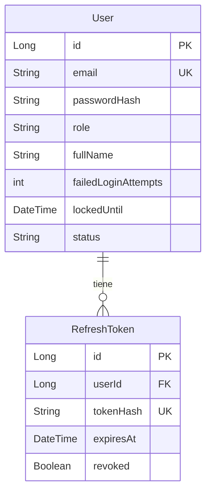

# Dominio de negocio — HS FACOP

Dimensión de **negocio** (sustituible por proyecto). Base de conocimiento del dominio: actores, glosario y modelo conceptual. Documento **vivo**: crece y se detalla a medida que cada capacidad se especifica y construye.

- Complementa `docs/vision.md` (objetivos + roadmap), `docs/architecture.md` (capas) y `docs/backend.md` (JPA/persistencia).
- Aquí va el **modelo conceptual** (entidades, relaciones, reglas de negocio de alto nivel). El **esquema físico** lo define Flyway (`modules/backend/.../db/migration`), no este documento.

> 📝 **Plantilla.** Las secciones marcadas con ✏️ son para rellenar en cada proyecto derivado. Lo marcado como *(construida)* describe lo que la plantilla ya trae.

---

## Actores del negocio ✏️

| Actor | Descripción | Rol de sistema (aprox.) |
|---|---|---|
| **Administrador** | Gestiona la aplicación: usuarios, configuración y métricas del panel. | `ADMIN` |
| **Usuario** | Usa las funcionalidades del producto dentro de su rol. | `USER` |
| _[actor de negocio]_ | _[descripción]_ | _[rol]_ |

> Los roles de sistema (`ADMIN`/`USER`) los define `authentication`; el mapeo fino de permisos se detalla al construir cada capacidad.

## Glosario de términos clave ✏️

| Término | Significado |
|---|---|
| _[término del dominio]_ | _[significado]_ |

---

## Fuente de verdad (local-first)

| Tipo de información | Vive en |
|---|---|
| Modelo de dominio (este doc) | `docs/domain.md` (local) |
| Comportamiento / casos de uso | `openspec/specs/<cap>/spec.md` (Scenarios) |
| Framing de user story ("como X quiero Y") | `proposal.md` del change |
| Backlog / tickets | *(opcional)* — hoy: local. Futuro híbrido: Jira |

> **Nota para el futuro híbrido (Jira).** Si más adelante se adopta Jira: sigue siendo **la capa de backlog**, nunca la fuente de verdad del dominio ni de lo construido. Regla: una sola fuente por tipo de info; el change referencia `JIRA-<id>` de forma cruzada. El dominio y las specs permanecen locales.

---

## Convenciones

- **Nivel de detalle**: aquí se listan entidades y campos **conceptuales** clave. Los tipos exactos, longitudes y validaciones finas se fijan en el `spec.md`/`design.md` de cada capacidad y en la migración Flyway correspondiente.
- Toda entidad tiene `id` (PK) y campos de auditoría (`createdAt`, `updatedAt`) salvo que se indique.
- Identificadores en inglés (convención de código); ver `docs/backend.md`.

---

## Entidades por capacidad

### `authentication` → **User** *(construida)*
Cuenta de acceso al sistema.
- `email` (único), `passwordHash` (BCrypt), `role` (`ADMIN` | `USER`), `fullName`, `createdAt`/`updatedAt`.
- Bloqueo temporal por intentos fallidos (`add-login-lockout`): `failedLoginAttempts` (fallos consecutivos, se resetea con un login correcto o al fallar tras expirar el bloqueo) y `lockedUntil` (fin del bloqueo automático; nulo = sin bloqueo). Solo los modifican `UPDATE` atómicos; la entidad los lee pero no los escribe.
- Estado administrativo (`users`, `add-user-account-status`): `status` (`ACTIVE` | `DISABLED`), **independiente** de `lockedUntil` (si compartieran campo, expirar el bloqueo automático reactivaría una cuenta deshabilitada a mano). Las cuentas nuevas nacen `ACTIVE`; solo un `ADMIN` cambia el estado, y solo de cuentas `USER`; una cuenta `DISABLED` no inicia ni renueva sesión.
- Candidatos para cambios posteriores de `users` (perfil, alta por admin, roles): `username`, `phone`.

### `authentication` → **RefreshToken** *(construida)*
Token de refresco persistido para rotación y revocación real (logout). Se guarda el **hash** del token, nunca el valor en claro.
- `user` (FK), `tokenHash` (único), `expiresAt`, `revoked`, `createdAt`. El access token es JWT stateless (no se persiste).

### _[capacidad de negocio]_ → **_[Entidad]_** ✏️
_[qué representa]_
- _[campos conceptuales clave]_

---

## Diagrama ER (conceptual)

> Se amplía con cada capacidad de negocio.

---

## Cómo se actualiza este documento

1. Al proponer una capacidad (`/opsx:propose`), su `design.md` detalla las entidades/campos nuevos.
2. Al implementarla, la migración Flyway crea el esquema real.
3. Al archivar el change, se **consolida** aquí la parte del dominio afectada (entidades, campos, relaciones y reglas ya construidas), manteniendo el ER al día.
